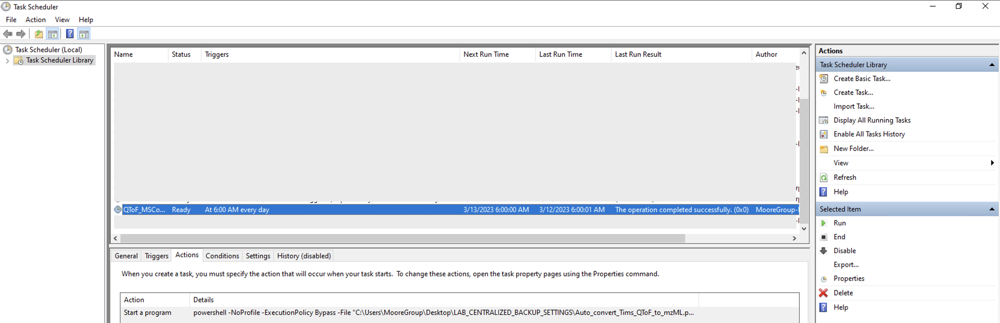

# powershell_auto_mzml_convert
This is a powershell script that "walks" through a directory, and uses MSConvert to convert all the native liquid-chromatography mass-spectrometry (LC-MS) files into .mzML format, leaving them in the same directory as the native LC-MS files. MSConvert is available as apart of the free [Proteowizard software package](https://proteowizard.sourceforge.io/download.html). Powershell is likely a native install on your Windows PC. 

See the "Auto_convert_QToF_to_mzML.ps1" script:
https://github.com/photocyte/powershell_auto_mzml_convert/blob/43267c21b350e31b58fff8b0a6c0e0d9fe35ebe4/Auto_convert_QToF_to_mzML.ps1#L1

Then, you can use [Windows Task Scheduler](https://en.wikipedia.org/wiki/Windows_Task_Scheduler) to run the script automatically every morning:


The specific incantation within Task Scheduler is:
```
powershell -NoProfile -ExecutionPolicy Bypass -File 'PATH_TO_YOUR_POWERSHELL_SCRIPT'
```
